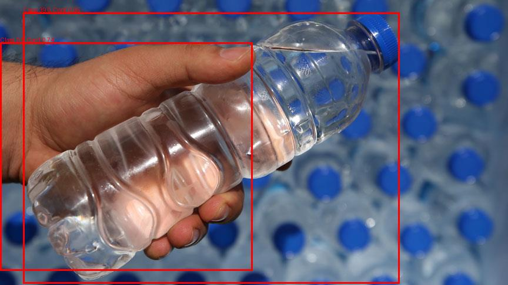

# YOLO11 FastAPI ile Uçtan Uca Yapay Zeka Servisi

Bu proje, **YOLO11** modelini kullanarak görseller üzerinde nesne tespiti yapan bir uçtan uca yapay zeka servisidir. Projede, **FastAPI** framework'ü kullanılarak bir REST API oluşturulmuş ve modelin tahmin sonuçları görselleştirilmiştir.

---

## 1. Kullanılan Yöntemler ve Teknolojiler
### Platform ve Teknolojiler
- **Python**: Uygulamanın temel programlama dili.
- **FastAPI**: REST API oluşturmak için kullanılan framework.
- **YOLO11**: Önceden eğitilmiş nesne tespiti modeli.
- **Pillow**: Görüntü işleme ve tahmin sonuçlarını görselleştirmek için kullanıldı.
- **Uvicorn**: FastAPI uygulamasını çalıştırmak için kullanılan ASGI sunucusu.

---

## 2. Tahmin Süreci
1. **Görüntü Yükleme**:
   - `/predict` endpoint'ine bir `.jpg` formatındaki görüntü gönderilir.
2. **Model Tahmini**:
   - **YOLO11** modeli, yüklenen görüntüdeki nesneleri tespit eder.
   - Her tespit için nesne sınıfı, doğruluk oranı ve koordinat bilgileri döndürülür.
3. **Sonuçların Görselleştirilmesi**:
   - Modelin tahmin ettiği nesneler görüntü üzerinde işaretlenir ve `outputs/` klasörüne kaydedilir.

---

## 3. Uygulama Altyapısı
### Endpointler
- **`/predict`**: 
  - **HTTP Metodu**: `POST`
  - **Açıklama**: Bir görsel dosya yükleyerek nesne tespiti yapılmasını sağlar.
  - **Girdi**: Form-data ile bir `.jpg` dosyası.
  - **Çıktı**:
    ```json
    {
        "filename": "example.jpg",
        "predictions": [
            {
                "class": [39.0, 0.0],
                "confidence": [0.94, 0.73],
                "coordinates": [[39, 21, 679, 483], [0, 72, 429, 461]]
            }
        ]
    }
    ```

---

## 4. Sonuçlar
### Tahmin Çıktıları
- **JSON Yanıtı**: Yüklenen görüntüdeki nesnelerin sınıf, doğruluk oranı ve koordinat bilgilerini içerir.
- **Görselleştirilmiş Çıktı**: Tahmin edilen nesneler, işlenen görüntü üzerinde çerçevelerle gösterilir. Bu görüntüler `outputs/` klasöründe saklanır.

Örnek bir işlenmiş görüntü:


---

## 5. Performans Değerlendirmesi
- **Doğruluk**:
  - Model, test görüntülerinde yüksek doğruluk oranlarıyla nesne tespiti yapmıştır.
  - Örneğin: Fotoğraftaki el %74 oranıyla doğru bilinmiştir.

---

## 6. Proje Dosya Yapısı
```plaintext
project/
│
├── app.py             # FastAPI uygulaması
├── model/             # YOLO11 model dosyası (yolo11x.pt)
├── images/            # Test için kullanılan görüntüler
├── outputs/           # Görselleştirilmiş tahmin sonuçları
└── README.md          # Proje açıklamaları ve dokümantasyon

## 7. Kurulum ve Çalıştırma

### Gerekli Kütüphaneler
Proje için gerekli kütüphaneleri aşağıdaki komutla yükleyebilirsiniz:
```bash
pip install -r requirements.txt
# Yolo11andFastApi
